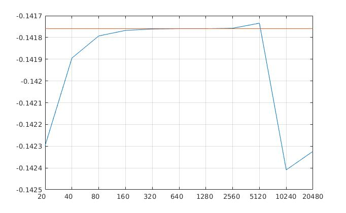

# Oppgave 6

a)
---

$$
f = -480wdg
$$

Siden det legges en sinusformet haug på stupebrettet må vi legge på funksjonen $$
s(x) = -pgsin(\frac{\pi}{L}x)
$$

på $f$:

$$
f(x) = -480wdg - pgsin(\frac{\pi}{L}x)
$$

Skal i oppgaven vise at 

$$
y(x) = \frac{f}{24EI}x^2(x^2-4Lx + 6L^2) - \frac{gpL}{EI\pi}(\frac{L^3}{\pi^3}sin(\frac{\pi}{L}x)-\frac{x^3}{6}+ \frac{Lx^2}{2}-\frac{L^2x}{\pi^2})
$$

tilfredsstiller Euler-Bernoulli-likningen og randbetingelsene for en bjelke som er festet i den ene enden og fri i den andre.

Starter da med å derivere y(x) 4 ganger (bruker symbolab for utregning):

$$
\begin{aligned}
y'(x) &= \frac{fx\left(x^2-3Lx+3l^2\right)}{6EI}-\frac{Lgp\left(-\pi ^2x^2+2\pi ^2Lx+2l^2\cos \left(\frac{\pi x}{L}\right)-2l^2\right)}{2\pi ^3EI}\\
y''(x) &= \frac{2gL^2psin(\frac{\pi x}{L}) + \pi^2fx^2 + (2\pi gLp - 2\pi^2fL)x - 2\pi gL^2p + \pi^2fL^2}{2\pi^2EI}\\
y'''(x) &= \frac{gLpcos(\frac{\pi x}{L})+\pi fx + gLp - \pi fL}{\pi EI}\\
y''''(x) &= -\frac{gpsin(\frac{\pi x}{L}) - f}{EI} = \frac{f-gpsin(\frac{\pi x}{L})}{EI}
\end{aligned}
$$

Sjekker med Euler-Bernoulli-likningen: 

$$
EIy'''' = EI \cdot \frac{f-gpsin(\frac{\pi x}{L})}{EI}= \underline{\underline{f - pgsin(\frac{\pi x}{L}) = f(x)}}
$$

Dette viser at y(x) oppfyller Euler-bernoulli-likningen.

Neste steg er å vise at den oppfyller rand-betingelsene:

$$
y(0) = y'(0) = y''(L) = y'''(L) = 0
$$

Sjekker for $y(0), y'(0), y''(L), y'''(L):$

$$
\begin{aligned}
y(0) &= \frac{f}{24EI}\cdot 0(0-4L\cdot0 + 6L^2) - \frac{gpL}{EI\pi}(\frac{L^3}{\pi^3}sin(\frac{\pi}{L}0)-\frac{0^3}{6}+ \frac{L\cdot0^2}{2}-\frac{L^2\cdot0}{\pi^2}) = \underline{0}\\
y'(0) &= \frac{f0\left(0^2-3L0+3l^2\right)}{6EI}-\frac{Lgp\left(-\pi ^2\cdot0^2+2\pi ^2L0+2L^2\cos \left(\frac{\pi \cdot0}{L}\right)-2L^2\right)}{2\pi ^3EI} = \underline{0}\\
y''(L)&= \frac{2gL^2psin(\frac{\pi L}{L}) + \pi^2fL^2 + (2\pi gLp - 2\pi^2fL)L - 2\pi gL^2p + \pi^2fL^2}{2\pi^2EI}\\ &= \frac{2\pi^2fL^2 - 2\pi^2fL^2 + 2\pi gL^2p - 2\pi gL^2p }{2\pi^2EI} =\frac{0+0}{2\pi^2EI} = \underline{0}\\
y'''(L) &= \frac{gLpcos(\frac{\pi L}{L})+\pi fL + gLp - \pi fL}{\pi EI} = \frac{-glP + glP -\pi fL + \pi fL}{\pi EI} = \underline{0}
\end{aligned}
$$

Ser da at y(x) oppfyller randbetingelsene.

b)
---
Skal gjøre det samme som i oppgave 5, men med den sinusformede haugen i tillegg. Derfor blir y(x) og f(x) annerledes. 
Rød strek er den riktige verdien for y(x), mens den blåe linja viser den numeriske bergnede løsningen. 
Feilen er stor i starten når antallet n er liten (ved A = 20*20 matrise) og blir mer lik riktig verdi når n går mot 320. Feilen blir større igjen når n blir veldig høy (etter 2560)

Graf laget i MATLAB, i vedlegg oppg6b.m
